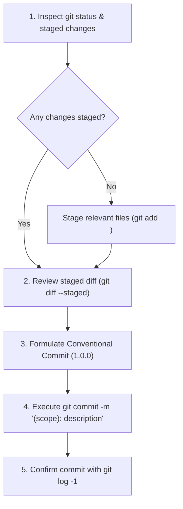
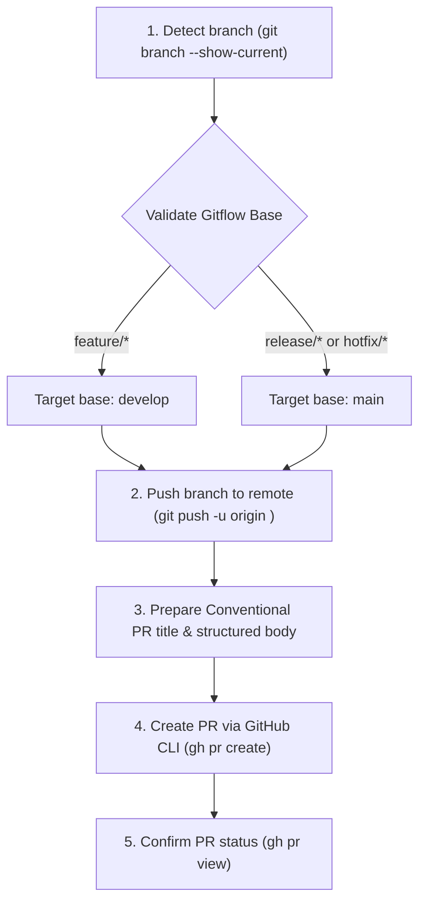

# Git Workflow: Conventional Commits & Gitflow with GitHub CLI (`gh`)

A standardized workflow for AI coding agents to handle Git commits, branch lifecycles, and Pull Requests (PRs) across repositories, enforcing [Conventional Commits v1.0.0](https://www.conventionalcommits.org/en/v1.0.0/) and the [Atlassian Gitflow Workflow](https://www.atlassian.com/git/tutorials/comparing-workflows/gitflow-workflow) through native `git` commands and the official **GitHub CLI** (`gh`).

---

## Core Non-Negotiable Standards

1. **GitHub CLI (`gh`) for GitHub Operations**:
   - Use the official GitHub CLI (`gh`) in the terminal for all GitHub-hosted interactions: creating Pull Requests (`gh pr create`), checking PR status (`gh pr view`, `gh pr checks`), managing issues (`gh issue`), and inspecting repository state.
   - For local version control operations (staging, diff inspection, committing, branch management, history check), use standard `git` commands.

2. **Conventional Commits 1.0.0 Compliance**:
   - Synthesize commit messages directly adhering to [Conventional Commits v1.0.0](https://www.conventionalcommits.org/en/v1.0.0/).
   - Format: `<type>[optional scope]: <description>`
   - Allowed types: `feat`, `fix`, `docs`, `style`, `refactor`, `perf`, `test`, `build`, `ci`, `chore`, `revert`.
   - Description rules: Imperative present-tense ("add", not "added"), lowercase start, no period at end, under 72 characters.
   - Breaking changes must use `!` before the colon (e.g., `feat(api)!: ...`) and/or include a `BREAKING CHANGE: <explanation>` footer.
   - See [references/conventional-commits.md](references/conventional-commits.md) for the full specification.

3. **Gitflow Branching & Target Rules**:
   - `main`: Stores official release history and production code. Never commit or merge feature branches directly into `main`. Commits are tagged (`vX.Y.Z`).
   - `develop`: Integration branch for features and fixes.
   - `feature/<name>`: Branched from `develop`. Pull requests **MUST target `develop`**.
   - `release/<version>`: Branched from `develop`. Merged into BOTH `main` (tagged) and `develop`.
   - `hotfix/<name>`: Branched from `main`. Merged into BOTH `main` (tagged) and `develop`.
   - See [references/gitflow.md](references/gitflow.md) for branch lifecycles.

4. **Never Leave Incomplete PRs or Commits**:
   - Always inspect working tree status before committing (`git status`).
   - Always verify what files are staged (`git diff --staged`).
   - Never stage secrets, credentials, or untracked temporary files.
   - Always ensure remote tracking is established before creating a PR (`git push -u origin <branch>`).

---

## Workflow 1: Creating a Commit

Follow these steps whenever the user asks to commit changes:



### Step 1: Inspect Changes
Run:
```bash
git status
git diff --staged --stat
```
If changes are not staged, review modified files and stage the appropriate changes (`git add <files>`). Do not blindly run `git add -A` if untracked temporary or secret files are present.

### Step 2: Formulate Conventional Commit Message
Analyze the staged diff directly and determine:
- **Type**: `feat`, `fix`, `refactor`, `test`, `docs`, `chore`, `style`, `perf`, `build`, `ci`.
- **Scope** (optional but recommended): Component, module, or package affected (e.g. `auth`, `widgets`, `navigation`, `cli`).
- **Subject**: Imperative mood summary ("add support for biometric auth", not "added" or "adds").
- **Body / Footer** (when appropriate): Contextual explanation, breaking change notices, or issue references (`Closes #123`).

### Step 3: Execute Commit
Apply the commit with title and optional body/footer:
```bash
git commit -m "<type>(<scope>): <imperative description>"
```
Or with an extended body:
```bash
git commit -m "<type>(<scope>): <imperative description>" -m "<detailed description of rationale>"
```

### Step 4: Verification
Confirm the commit:
```bash
git log -1 --stat
```

---

## Workflow 2: Creating a Pull Request (PR)

Follow these steps whenever the user asks to open or create a Pull Request:



### Step 1: Detect Branch and Validate Gitflow
Check the current branch:
```bash
git branch --show-current
```

Determine the required base branch according to the Gitflow matrix:
- **`feature/*`** $\rightarrow$ Base branch **must be `develop`**:
  `--base develop`
- **`release/*`** $\rightarrow$ Base branch is `main` (and subsequently synced to `develop`):
  `--base main`
- **`hotfix/*`** $\rightarrow$ Base branch is `main` (and subsequently synced to `develop`):
  `--base main`

> [!WARNING]
> If on a `feature/*` branch and someone attempts to target `main`, **stop and correct the target to `develop`** to prevent corrupting production history.

### Step 2: Push Branch to Remote
Ensure the branch exists on the remote with upstream tracking:
```bash
git push -u origin <current-branch>
```

### Step 3: Formulate PR Title and Body
The PR title **must follow Conventional Commits** matching the primary feature or fix:
- Title format: `<type>(<scope>): <imperative summary>`
- Example: `feat(auth): add biometric authentication for mobile logins`

Use this structured markdown PR body template:
```markdown
## Summary
<!-- Concise overview of the changes introduced by this PR -->

## Type of Change
- [ ] `feat`: New feature
- [ ] `fix`: Bug fix
- [ ] `refactor`: Code refactoring
- [ ] `test`: Test suite update
- [ ] `chore`: Maintenance/dependency update
- [ ] `docs`: Documentation update

## Gitflow Alignment
- Source Branch: `<head-branch>`
- Target Branch: `<base-branch>` (e.g. `develop` for features, `main` for releases/hotfixes)

## Verification & Testing
<!-- Describe how changes were verified (unit tests, manual QA, linter) -->
- [ ] All automated tests pass
- [ ] Linter checks pass with zero errors

## Related Issues
Closes #<issue-number>
```

### Step 4: Execute via GitHub CLI (`gh pr create`)
Create the PR using the `gh` command in the terminal:
```bash
gh pr create --base <base-branch> --head <current-branch> --title "<type>(<scope>): <description>" --body "<body-content>"
```

### Step 5: Verify PR Status
Confirm the PR was created successfully:
```bash
gh pr view
```

---

## Workflow 3: Gitflow Branch Management

### Starting a Feature
Always branch from the latest `develop`:
```bash
git checkout develop
git pull origin develop
git checkout -b feature/<feature-name>
```

### Starting a Release
When all features for a version milestone are merged into `develop`:
```bash
git checkout develop
git pull origin develop
git checkout -b release/v<major>.<minor>.0
```

### Starting a Hotfix
When a critical bug is found in production:
```bash
git checkout main
git pull origin main
git checkout -b hotfix/v<major>.<minor>.<patch>-<issue>
```

---

## References

For detailed guidelines and deep dives, consult:
- [references/conventional-commits.md](references/conventional-commits.md): Full Conventional Commits v1.0.0 specification, type definitions, breaking changes, and git trailer footers.
- [references/gitflow.md](references/gitflow.md): Comprehensive Atlassian Gitflow branching rules, branch lifecycle, and merge procedures.
