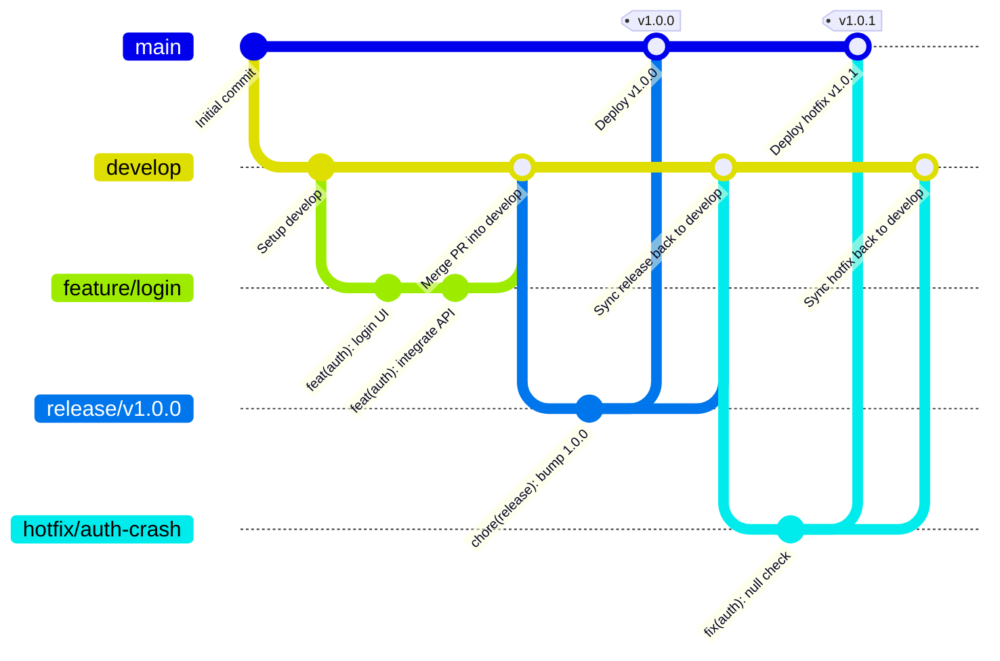

# Gitflow Workflow Reference

This document provides the standard operational guide for the [Atlassian Gitflow Workflow](https://www.atlassian.com/git/tutorials/comparing-workflows/gitflow-workflow) across FK repositories.

---

## 1. Branch Architecture

Gitflow defines a strict branching model designed around project releases. It isolates work in progress from production-ready code using two primary branches and three types of supporting branches.



---

## 2. Primary Branches

### `main` (or `master`)
- **Purpose**: Stores official release history and production-ready code.
- **Rules**:
  - Direct commits to `main` are strictly forbidden.
  - Every commit on `main` represents a production release and **must** be tagged with a semantic version (e.g., `v1.2.0`).
  - Code on `main` must always be deployable to production.

### `develop`
- **Purpose**: Serves as the integration branch for all completed features.
- **Rules**:
  - Acts as the baseline and parent for all new feature branches.
  - Contains the full history of the project being prepped for the next release.
  - Nightly builds or integration test suites run off `develop`.

---

## 3. Supporting Branches

### 3.1 Feature Branches (`feature/*`)
- **Branches off**: `develop`
- **Merges back into**: `develop`
- **Naming convention**: `feature/<feature-name>` or `feature/<issue-number>-<short-description>`
  - Examples: `feature/dark-mode`, `feature/124-oauth-refresh`
- **Lifecycle**:
  1. Create branch from up-to-date `develop`:
     ```bash
     git checkout develop
     git pull origin develop
     git checkout -b feature/dark-mode
     ```
  2. Implement changes with Conventional Commits.
  3. Push to remote:
     ```bash
     git push -u origin feature/dark-mode
     ```
  4. Open Pull Request targeting `develop` (never `main`):
     ```bash
     gh pr create --base develop --head feature/dark-mode --title "feat(ui): add dark mode theme support"
     ```
  5. After PR review and merge, delete local and remote feature branch.

### 3.2 Release Branches (`release/*`)
- **Branches off**: `develop`
- **Merges back into**: BOTH `main` AND `develop`
- **Naming convention**: `release/<version>` (e.g., `release/v1.2.0` or `release/1.2.0`)
- **Lifecycle**:
  1. Once `develop` has acquired all features for the upcoming release:
     ```bash
     git checkout develop
     git pull origin develop
     git checkout -b release/v1.2.0
     ```
  2. Perform release-only tasks on this branch:
     - Version number bumps (`pubspec.yaml`, `package.json`, `apm.yml`).
     - Documentation and CHANGELOG updates.
     - Minor bug fixes discovered during release validation (no new features!).
  3. When ready to ship:
     - Open PR into `main`:
       ```bash
       gh pr create --base main --head release/v1.2.0 --title "chore(release): prepare v1.2.0"
       ```
     - Merge into `main` and tag the release:
       ```bash
       git checkout main
       git pull origin main
       git tag -a v1.2.0 -m "Release v1.2.0"
       git push origin main --tags
       ```
     - Merge back into `develop` to sync version bumps and bug fixes:
       ```bash
       git checkout develop
       git pull origin develop
       git merge release/v1.2.0
       git push origin develop
       ```
  4. Delete the release branch.

### 3.3 Hotfix Branches (`hotfix/*`)
- **Branches off**: `main`
- **Merges back into**: BOTH `main` AND `develop` (and current release branch if one exists)
- **Naming convention**: `hotfix/<fix-name>` or `hotfix/<version>` (e.g., `hotfix/v1.2.1-login-crash`)
- **Lifecycle**:
  1. Branch directly from `main` to address critical production issues:
     ```bash
     git checkout main
     git pull origin main
     git checkout -b hotfix/v1.2.1-login-crash
     ```
  2. Commit fix following Conventional Commits (`fix(auth): ...`).
  3. Bump patch version.
  4. Open PR to merge into `main`:
     ```bash
     gh pr create --base main --head hotfix/v1.2.1-login-crash --title "fix(auth): handle null token on startup"
     ```
  5. Merge into `main`, tag with new patch version (`v1.2.1`), and push tags.
  6. Merge back into `develop`:
     ```bash
     git checkout develop
     git pull origin develop
     git merge hotfix/v1.2.1-login-crash
     git push origin develop
     ```
  7. Delete hotfix branch.

---

## 4. Pull Request Target Matrix

| Working Branch Type | Target Base Branch | When Merged |
| :--- | :--- | :--- |
| `feature/*` | **`develop`** | Feature complete & reviewed |
| `release/*` | **`main`** (and sync into **`develop`**) | Release prepped and tested |
| `hotfix/*` | **`main`** (and sync into **`develop`**) | Critical production fix verified |
| Any experimental branch | **`develop`** | Evaluated and approved |

> [!CAUTION]
> **Never open a Pull Request targeting `main` directly from a `feature/*` branch.** In Gitflow, feature branches must always merge into `develop`.
