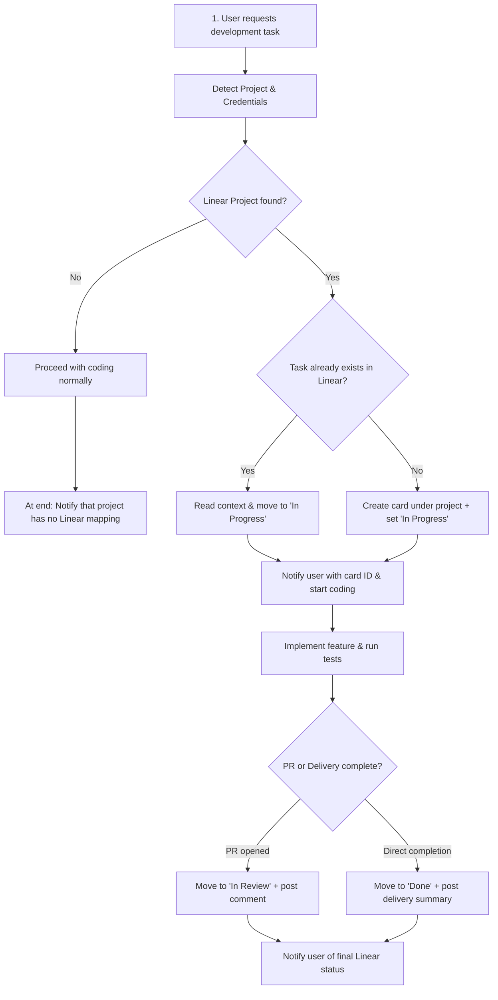

# Linear Workflow: Seamless Task Tracking & Lifecycle Sync

A standardized workflow for AI coding agents to integrate Linear issue management directly into development and planning lifecycles. Supports native Linear MCP servers and provides a standalone zero-dependency Python CLI helper (`scripts/linear_api.py`) for GraphQL API execution.

---

## Core Non-Negotiable Standards

1. **Zero Hardcoded Secrets & Dynamic Credential Resolution**:
   - Never hardcode tokens or API keys into prompts, code, or configuration files.
   - Dynamically discover credentials in priority order:
     1. Linear MCP server tools (`linear_issue_search`, `linear_create_issue`, etc.), if present.
     2. Environment variable: `LINEAR_API_KEY` or `LINEAR_TOKEN`.
     3. Project-level `.linear.json`, `.linearrc`, or `.env`.
   - If no credentials exist, warn the user once and continue the development task without blocking.

2. **Non-Blocking Project Fallback**:
   - If the project does not exist in Linear, **never halt or abort** the user's task.
   - Proceed with development or implementation normally.
   - Inform the user clearly at the start or completion that the project is not tracked in Linear.

3. **Lifecycle State Machine**:
   - Enforce the official state progression:
     `Backlog` ➔ `Todo` ➔ `Technical Analysis` ➔ `In Progress` ➔ `In Review` ➔ `Done` (plus `Canceled` or `Duplicate`).
   - Planning mode places items in `Backlog` or `Todo`.
   - Investigation or architectural spikes move items to `Technical Analysis`.
   - Active coding moves items to `In Progress`.
   - Pull Requests and verification moves items to `In Review`.
   - Merged or finalized deliveries move items to `Done`.

4. **Parent Project & Subproject Component Labeling**:
   - Detect when a repository represents a subproject of a unified Linear project (e.g., local project `Rent Easy Frontend` or `Rent Easy Backend` mapping to parent Linear project `Rent Easy`).
   - Automatically tag cards with **`Front`** (Flutter, React, Vue, Web, Mobile) or **`Back`** (Spring Boot, Node, Java, Python API) component labels.

5. **100% Transparency & User Notification**:
   - **Every** Linear operation (issue queried, card created, state transitioned, or missing project) must be explicitly communicated in the response with issue keys (e.g. `LIN-42`) and status.

---

## Tool Execution Matrix (MCP vs Bundled CLI)

The agent dynamically uses whatever tool is available in the current environment:

| Operation | Linear MCP Available | Bundled CLI (`python skills/linear-workflow/scripts/linear_api.py`) |
| :--- | :--- | :--- |
| **Verify Auth** | Automatically authenticated | `python <skill-dir>/scripts/linear_api.py auth-check` |
| **Find Project** | `linear_list_projects` | `python <skill-dir>/scripts/linear_api.py find-project "<name>"` |
| **Search Issue** | `linear_issue_search` | `python <skill-dir>/scripts/linear_api.py search-issues "<term>" --project-id "<id>"` |
| **Create Card** | `linear_create_issue` | `python <skill-dir>/scripts/linear_api.py create-issue --team-id "<tid>" --project-id "<pid>" --title "<title>" --description "<desc>" --state "<state>" --label "Front"` |
| **Update State** | `linear_update_issue` | `python <skill-dir>/scripts/linear_api.py update-issue "<id>" --team-id "<tid>" --state "In Progress"` |
| **Add Comment** | `linear_create_comment` | `python <skill-dir>/scripts/linear_api.py update-issue "<id>" --comment "<summary>"` |

---

## Workflow 1: Task Implementation & Auto-Tracking

Follow this workflow whenever asked to develop, implement, or fix a task (e.g. *"vamos desenvolver a tarefa X"*, *"quero desenvolver x funcionalidade"*):



### Step 1: Detect Project & Subproject Context
1. Read project name from `.linear.json`, `package.json`, `pubspec.yaml`, `pom.xml`, or working directory name.
2. Search for the project in Linear using MCP or:
   ```bash
   python skills/linear-workflow/scripts/linear_api.py find-project "<project-name>"
   ```
3. If no project is found:
   - Output note: `ℹ️ [Linear]: Projeto '<nome>' não localizado no Linear. O desenvolvimento prosseguirá normalmente.`
   - Continue task implementation immediately.
   - At the conclusion of your response, remind the user that the project was not linked to Linear.

### Step 2: Search or Create Issue
If the project exists:
1. Search project issues for the requested task:
   ```bash
   python skills/linear-workflow/scripts/linear_api.py search-issues "<task keywords>" --project-id "<project-id>"
   ```
2. **If issue is found**:
   - Read full description, acceptance criteria, and previous comments.
   - Transition state to **`In Progress`**:
     ```bash
     python skills/linear-workflow/scripts/linear_api.py update-issue "<issue-id>" --team-id "<team-id>" --state "In Progress"
     ```
   - Inform user: `📋 [Linear]: Task encontrada '<KEY>: <Title>'. Status movido para 'In Progress'. Incorporando requisitos ao desenvolvimento.`
3. **If issue is NOT found**:
   - Determine component label (`Front` or `Back`) based on workspace files.
   - Create new issue in **`In Progress`**:
     ```bash
     python skills/linear-workflow/scripts/linear_api.py create-issue --team-id "<team-id>" --project-id "<project-id>" --title "<Title>" --description "<Description>" --state "In Progress" --label "Front"
     ```
   - Inform user: `➕ [Linear]: Nova task criada: '<KEY>: <Title>' no projeto '<Project>'. Status: 'In Progress'. Labels: ['Front'].`

### Step 3: Lifecycle Finalization
When development is complete:
- If submitting for review / opening PR: Move to **`In Review`** and attach summary comment.
- If task is fully delivered: Move to **`Done`** and attach completion summary.
- Notify user: `✅ [Linear]: Task <KEY> atualizada para '<Novo Status>'.`

---

## Workflow 2: Planning & Backlog Creation

Follow this workflow whenever the user asks to plan a project, sprint, or create cards without immediate coding (e.g. *"vamos planejar meu projeto"*, *"crie os cards de tais tarefas"*):

1. **Locate Target Project**: Find or confirm target Linear project and team ID.
2. **Break Down Scope**: Structure tasks into atomic items with title, user story/rationale, technical scope, and acceptance criteria.
3. **Identify Subproject Label**: Determine if items belong to `Front`, `Back`, or both.
4. **Create Cards in `Backlog` or `Todo`**:
   ```bash
   python skills/linear-workflow/scripts/linear_api.py create-issue --team-id "<team-id>" --project-id "<project-id>" --title "<Title>" --description "<Description>" --state "Backlog" --label "Front"
   ```
5. **Report to User**: Present a summary table of all cards created with their identifiers, titles, and links:
   ```markdown
   | Identificador | Título | Status | Labels |
   | :--- | :--- | :--- | :--- |
   | **RENT-12** | Implementar tela de checkout | Backlog | `Front` |
   | **RENT-13** | Endpoint de autorização de pagamento | Backlog | `Back` |
   ```

---

## Workflow 3: Technical Analysis & Investigation Spikes

When the user asks to analyze architecture, investigate a bug root cause, or evaluate technical feasibility:
1. Locate or create the corresponding issue.
2. Move state to **`Technical Analysis`**.
3. Notify the user: `🔬 [Linear]: Task <KEY> movida para 'Technical Analysis' para investigação técnica.`
4. Document findings and add a comment with key decisions to the Linear card.

---

## Concrete Interaction Examples

### Example 1: Planning Session
**User**: *"Vamos planejar o projeto Rent Easy: precisamos das tarefas de autenticação biométrica e listagem de imóveis."*
**Agent Actions**:
1. Queries project `Rent Easy` (finds team `ENG`, project ID `proj_123`).
2. Detects workspace is Flutter ➔ selects label `Front`.
3. Creates card 1: `RENT-21 - "Autenticação Biométrica com FaceID/TouchID"` (Status: `Backlog`, Label: `Front`).
4. Creates card 2: `RENT-22 - "Tela de Listagem de Imóveis com Filtros"` (Status: `Backlog`, Label: `Front`).
5. Informs user:
   > `📋 [Linear]: 2 tarefas criadas no projeto Rent Easy (Time ENG):`
   > - `RENT-21: Autenticação Biométrica [Backlog] [Front]`
   > - `RENT-22: Tela de Listagem de Imóveis [Backlog] [Front]`

### Example 2: Developing an Existing Task
**User**: *"Quero desenvolver a tarefa de autenticação biométrica do Rent Easy."*
**Agent Actions**:
1. Searches project `Rent Easy` for `autenticação biométrica`.
2. Finds `RENT-21`. Reads description and criteria.
3. Moves `RENT-21` to `In Progress`.
4. Informs user:
   > `📋 [Linear]: Task identificada: RENT-21 - "Autenticação Biométrica". Status atualizado para 'In Progress'. Iniciando implementação...`
5. Implements code and runs tests.
6. When complete: moves `RENT-21` to `In Review` and reports delivery.

### Example 3: Project Not Found in Linear
**User**: *"Implemente uma função de ordenação rápida no projeto QuickSortLab."*
**Agent Actions**:
1. Checks Linear for project `QuickSortLab` ➔ Not found.
2. Implements the quicksort algorithm directly.
3. Informs user:
   > `✅ Algoritmo implementado com sucesso.`
   > `⚠️ [Linear]: O projeto 'QuickSortLab' não foi encontrado no Linear. O desenvolvimento seguiu normalmente sem vincular cards.`

---

## References

- [references/states-and-labels.md](references/states-and-labels.md) for full state definitions and subproject rules.
- [references/configuration.md](references/configuration.md) for API key setup and MCP integration.
