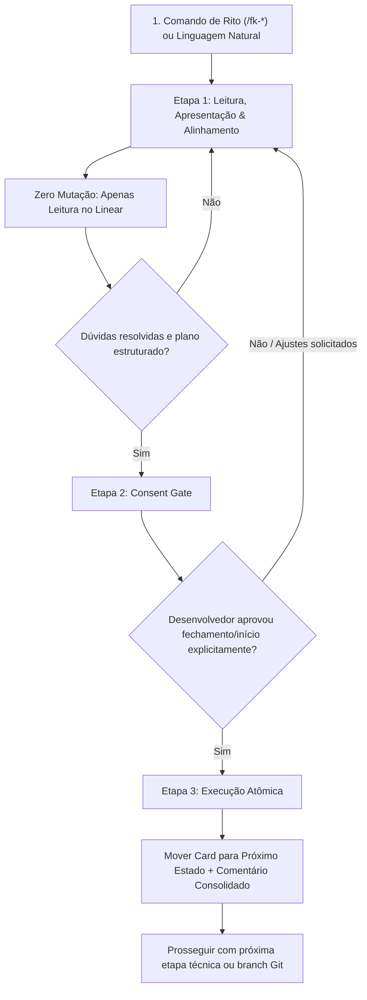

# Linear Workflow: Seamless Task Tracking, Lifecycle Commands & Consent Gate

A standardized workflow for AI coding agents to integrate Linear issue management directly into development and planning lifecycles. Supports native Linear MCP servers and provides a standalone zero-dependency Python CLI helper (`scripts/linear_api.py`) for GraphQL API execution with built-in comment idempotency, atomic updates, and automated state resolution.

---

## Core Non-Negotiable Standards

1. **Zero Hardcoded Secrets & Dynamic Credential Resolution**:
   - Never hardcode tokens or API keys into prompts, code, or configuration files.
   - Dynamically discover credentials in priority order:
     1. Linear MCP server tools (`linear_issue_search`, `linear_create_issue`, etc.), if present.
     2. Environment variable: `LINEAR_API_KEY` or `LINEAR_TOKEN`.
     3. Project-level `.linear.json`, `.linearrc`, or `.env`.
   - If no credentials exist, warn the user once and continue the development task without blocking.

2. **Non-Blocking Project Fallback**:
   - If the project does not exist in Linear, **never halt or abort** the user's task.
   - Proceed with development or implementation normally.
   - Inform the user clearly at the start or completion that the project is not tracked in Linear.

3. **Lifecycle State Machine & Responsabilidades de Transição**:
   - Enforce the official state progression:
     `Backlog` ➔ `Technical Analysis` ➔ `Todo` ➔ `In Progress` ➔ `In Review` ➔ `Done` (plus `Canceled` or `Duplicate`).
   - **Transições do Agente (Anti-Estagnação)**:
     - Conclusão de Análise Técnica: Agente move de `Technical Analysis` ➔ **`Todo`** com comentário estruturado.
     - Início de Desenvolvimento: Agente move de `Todo` ➔ **`In Progress`** com branch Git criada.
     - Conclusão de Desenvolvimento (PR Aberto): Agente move obrigatoriamente de `In Progress` ➔ **`In Review`** com link do PR e sumário técnico.
   - **Rito Exclusivamente Manual a partir de `In Review`**:
     - A partir de **`In Review`**, o controle é **exclusivamente manual pelo desenvolvedor**.
     - **`Done`**: O desenvolvedor move manualmente para **`Done`** após revisar o PR no GitHub, validar os testes e realizar o merge. O agente **NUNCA** move o card para `Done`.
     - **Retorno para Correções**: Se o desenvolvedor encontrar falhas ou pedir ajustes durante o review, o card pode ser retornado para **`In Progress`** (via intervenção no Linear ou comando no chat) para que o agente execute o ciclo corretivo.

4. **Mandatory 3-Stage Protocol (*Consent Gate*) & Syntactic Tolerance**:
   - Both for explicit commands (`/fk-*` and slash-free `fk-*`), aliases (`/fk-dev`, `fk-dev`, `/fk-ta`, `fk-ta`, `/fk-issue`, `fk-issue`), and natural language triggers (e.g. *"vamos analisar tecnicamente o card X"*, *"vamos desenvolver a tarefa Y"*), the agent must strictly follow this protocol across all harnesses (Google Antigravity, Claude Code, Cursor, GitHub Copilot):
     - **Stage 1 (Initial Presentation & Questions)**: The agent prepares the plan/analysis in chat/workspace, raising options and doubts with the developer. **Zero mutation**: No API calls altering Linear (`update-issue`, `create-issue`, `create-comment`) are permitted in this stage. Only read queries (`get-issue`, `search-issues`, `list-states`, `list-projects`) are allowed.
     - **Stage 2 (Consent Gate - Explicit Confirmation)**: After resolving all questions, the agent explicitly asks the developer for permission to close or start the phase on Linear (e.g.: *"O direcionamento está aprovado? Posso mover o card para [Status] e registrar o comentário consolidado?"*).
     - **Stage 3 (Atomic Execution - Move Card + Register Comment)**: Only after affirmative developer response, execute the closing actions atomically on Linear (advancing the status and registering the consolidated comment).

5. **Comment Idempotency & AIG Compliance**:
   - In accordance with Linear's official [Agent Interaction Guidelines (AIG)](https://linear.app/developers/agents):
     - Clearly signal agent identity: prefix all comments with `🤖 **AI Agent Update**:`.
     - Align with Linear Git automation: use the standard branch format `<type>/<identifier>-<slug>` (e.g. `feat/RENT-104-user-auth`).
     - **Idempotency Protection**: `scripts/linear_api.py` inspects recent card comments to prevent duplicate comments with identical body/payload within a 10-minute window.

6. **Parent Project & Subproject Component Labeling**:
   - Detect when a repository represents a subproject of a unified Linear project (e.g., local project `Rent Easy Frontend` or `Rent Easy Backend` mapping to parent Linear project `Rent Easy`).
   - Automatically tag cards with **`Front`** (Flutter, React, Vue, Web, Mobile) or **`Back`** (Spring Boot, Node, Java, Python API) component labels.

7. **100% Transparency & User Notification**:
   - Every Linear operation (issue queried, card created, state transitioned, or comment added) must be explicitly communicated in the response with issue keys (e.g. `LIN-42`) and status.

8. **Multi-Harness Architecture Support**:
   - Standardized APM primitives under `.apm/prompts/` (`.prompt.md`) and `.apm/instructions/` (`.instructions.md`) provide cross-platform command routing:
     - **Google Antigravity**: Unconditional rules in `.agents/rules/` and compiled `AGENTS.md` intercept commands and enforce the 3-stage Consent Gate without colliding with native slash commands.
     - **Claude Code**: Native custom slash commands in `.claude/commands/` and rules in `.claude/rules/`.
     - **Cursor**: Custom slash commands in `.cursor/commands/` and rules in `.cursor/rules/`.
     - **GitHub Copilot**: Prompt templates in `.github/prompts/` and instructions in `.github/instructions/`.

---

## Lifecycle Commands Reference

| Canonical Trigger | Slash-Free & Short Aliases | Target State Transition | Executado Por | Scope & Purpose |
| :--- | :--- | :--- | :--- | :--- |
| **`/fk-new-issue`** | `fk-new-issue`, `/fk-issue`, `fk-issue` | `Backlog` ou `Todo` | **Agente** (com Consent Gate) | Planejamento, decomposição e criação atômica de novos cards no Linear. |
| **`/fk-technical-analysis`** | `fk-technical-analysis`, `/fk-ta`, `fk-ta` | `Technical Analysis` ➔ `Todo` | **Agente** (com Consent Gate) | Investigação arquitetural, spikes técnicos, desenho de solução e avanço para `Todo` ao concluir. |
| **`/fk-develop`** | `fk-develop`, `/fk-dev`, `fk-dev` | `Todo` ➔ `In Progress` ➔ `In Review` | **Agente** | Início do desenvolvimento (`In Progress`), implementação, testes e avanço para `In Review` ao abrir o PR. |
| *(Retorno de Correção)* | `/fk-dev`, `fk-dev` | `In Review` ➔ `In Progress` | **Desenvolvedor / Agente** | Retorno do card para correções quando a revisão do PR apontar ajustes necessários. |
| *(Transição Manual)* | — | `In Review` ➔ `Done` | **Desenvolvedor** | **Exclusivamente manual pelo desenvolvedor** após merge e homologação da entrega. |

---

## Tool Execution Matrix (MCP vs Bundled CLI)

The agent dynamically uses whatever tool is available in the current environment:

| Operation | Official Linear MCP (`https://mcp.linear.app/mcp`) | Bundled CLI (`python skills/linear-workflow/scripts/linear_api.py`) |
| :--- | :--- | :--- |
| **Verify Auth** | OAuth 2.1 via Linear MCP | `python <skill-dir>/scripts/linear_api.py auth-check` |
| **Find Project** | `linear_list_projects` | `python <skill-dir>/scripts/linear_api.py find-project "<name>"` |
| **Get Issue** | `linear_issue_search` | `python <skill-dir>/scripts/linear_api.py get-issue "<key-or-id>"` |
| **Search Issue** | `linear_issue_search` | `python <skill-dir>/scripts/linear_api.py search-issues "<term>" [--project-id "<id>"]` |
| **Create Card** | `linear_create_issue` | `python <skill-dir>/scripts/linear_api.py create-issue --team-id "<tid>" --project-id "<pid>" --title "<title>" --description "<desc>" --state "<state>" --label "Front"` |
| **Atomic Update** | `linear_update_issue` + `linear_create_comment` | `python <skill-dir>/scripts/linear_api.py update-issue "<id>" [--team-id "<tid>"] [--state "<state>"] [--comment "<summary>"]` |
| **Add Comment** | `linear_create_comment` | `python <skill-dir>/scripts/linear_api.py update-issue "<id>" --comment "<summary>"` *(idempotente)* |

---

## Workflow 1: Protocolo Universal Consent Gate em 3 Etapas

Todo rito assistido (via comando `/fk-*` ou intenção em linguagem natural) segue rigorosamente este fluxo:


```mermaid
flowchart TD
    A["1. Comando de Rito (/fk-*) ou Linguagem Natural"] --> B["Etapa 1: Leitura, Apresentação & Alinhamento"]
    B --> C["Zero Mutação: Apenas Leitura no Linear"]
    C --> D{"Dúvidas resolvidas e plano estruturado?"}
    D -- "Não" --> B
    D -- "Sim" --> E["Etapa 2: Consent Gate"]
    E --> F{"Desenvolvedor aprovou fechamento/início explicitamente?"}
    F -- "Não / Ajustes solicitados" --> B
    F -- "Sim" --> G["Etapa 3: Execução Atômica"]
    G --> H["Mover Card para Próximo Estado + Comentário Consolidado"]
    H --> I["Prosseguir com próxima etapa técnica ou branch Git"]
```

---

## Workflow 2: Planejamento & Criação de Tarefas (`/fk-new-issue`)

Gatilhos: `/fk-new-issue`, `fk-new-issue`, `/fk-issue`, `fk-issue`, *"vamos planejar tarefas"*, *"crie os cards para..."*.

1. **Etapa 1 - Apresentação & Dúvidas (Leitura)**:
   - Localiza o projeto pai no Linear (`find-project`).
   - Decompõe os requisitos em tarefas atômicas no chat (título, descrição, critérios de aceitação e label `Front`/`Back`).
   - Apresenta a tabela proposta sem chamar `create-issue`.
2. **Etapa 2 - Consent Gate**:
   - Pergunta: *"O escopo e a divisão dos cards estão alinhados? Posso criá-los no Linear sob o status [Backlog/Todo]?"*
3. **Etapa 3 - Execução Atômica**:
   - Cria os cards no Linear via CLI/MCP.
   - Apresenta o sumário final com links diretos e IDs.

---

## Workflow 3: Análise Técnica & Spikes Arquiteturais (`/fk-technical-analysis`)

Gatilhos: `/fk-technical-analysis`, `fk-technical-analysis`, `/fk-ta`, `fk-ta`, *"vamos analisar tecnicamente o card X"*, *"faça um spike técnico sobre Y"*.

1. **Etapa 1 - Apresentação & Dúvidas (Leitura)**:
   - Consulta o card via `get-issue` ou `search-issues`.
   - Se o card estava em `Backlog`, o início da análise é apresentado no chat.
   - Realiza a análise arquitetural, opções de implementação, trade-offs e impactos no workspace.
   - **Zero mutação prematura no card**: Nenhum comentário preliminar ou mudança de estado é postada enquanto houver dúvidas em aberto.
2. **Etapa 2 - Consent Gate**:
   - Pergunta: *"A análise técnica está aprovada? Posso registrar as decisões no Linear e mover o card para **Todo** (pronto para desenvolvimento)?"*
3. **Etapa 3 - Execução Atômica**:
   - Executa atomicamente:
     ```bash
     python skills/linear-workflow/scripts/linear_api.py update-issue "<id>" --state "Todo" --comment "🤖 **AI Agent Update**: Análise Técnica Consolidada..."
     ```
   - O card avança formalmente para **`Todo`** e não permanece em `Technical Analysis`.

---

## Workflow 4: Ciclo de Desenvolvimento & Implementação (`/fk-develop`)

Gatilhos: `/fk-develop`, `fk-develop`, `/fk-dev`, `fk-dev`, *"vamos desenvolver a tarefa X"*, *"quero implementar o card Y"*.

1. **Etapa 1 - Apresentação & Dúvidas (Leitura)**:
   - Lê o card (`get-issue <id>`), requisitos, histórico de comentários e critérios de aceitação.
   - Apresenta o plano de implementação, arquivos afetados e a branch de trabalho proposta (`<type>/<key>-<slug>`).
2. **Etapa 2 - Consent Gate**:
   - Pergunta: *"O plano de desenvolvimento está aprovado? Posso mover o card para **In Progress** e criar a branch de trabalho?"*
3. **Etapa 3 - Execução Atômica & Início de Codificação**:
   - Transiciona o card para **`In Progress`** com comentário inicial:
     ```bash
     python skills/linear-workflow/scripts/linear_api.py update-issue "<id>" --state "In Progress" --comment "🤖 **AI Agent Update**: Início do desenvolvimento na branch <branch-name>..."
     ```
   - Cria a branch Git alinhada ao Gitflow e inicia a codificação e testes.
4. **Etapa 4 - Finalização do Desenvolvimento & Movimentação para `In Review`**:
   - Após implementar, rodar a suíte de testes e abrir o Pull Request no GitHub (`gh pr create`):
   - **O agente move obrigatoriamente o card para `In Review`**:
     ```bash
     python skills/linear-workflow/scripts/linear_api.py update-issue "<id>" --state "In Review" --comment "🤖 **AI Agent Update**: Desenvolvimento concluído e PR aberto no GitHub: <pr-url>..."
     ```
   - Notifica o desenvolvedor de que a tarefa está pronta para sua revisão manual.

---

## Workflow 5: Rito de Revisão Manual & Conclusão (`In Review` ➔ `Done`)

A partir da coluna **`In Review`**, o controle é exclusivamente manual pelo desenvolvedor:

1. **Revisão Humana do Pull Request**:
   - O desenvolvedor analisa o código no GitHub, valida os testes automatizados e a conformidade funcional.
2. **Cenário A: Necessidade de Correções / Ajustes**:
   - O desenvolvedor devolve o card para **`In Progress`** e sinaliza ao agente no chat as correções necessárias.
   - O agente assume as correções na branch existente, comita, atualiza o PR e, ao finalizar, move novamente para **`In Review`**.
3. **Cenário B: Aprovação & Merge**:
   - O desenvolvedor realiza o merge do PR no GitHub.
   - O **desenvolvedor move manualmente o card para `Done`**.
   - O agente nunca força a transição para `Done` sem intervenção humana no repositório remoto.

---

## Concrete Interaction Examples

### Example 1: Consent Gate em Análise Técnica
**Usuário**: `"/fk-ta FAL-24"`  
**Agente (Etapa 1)**: Consulta `get-issue FAL-24`, estuda a arquitetura e responde no chat com a análise detalhada e trade-offs.  
**Agente (Etapa 2)**: *"O direcionamento da análise técnica está aprovado? Posso registrar o sumário e avançar o card para **Todo**?"*  
**Usuário**: *"Aprovado, pode registrar."*  
**Agente (Etapa 3)**: Executa `update-issue FAL-24 --state "Todo" --comment "..."`. Comunica ao usuário a transição concluída.

### Example 2: Ciclo de Desenvolvimento e Entrega em `In Review`
**Usuário**: `"Vamos desenvolver a tarefa FAL-24"`  
**Agente (Etapa 1 & 2)**: Lê os critérios do card, apresenta o plano de branch e arquivos a alterar, e pergunta: *"Podemos criar a branch `feat/FAL-24-...`, mover o card para **In Progress** e iniciar a implementação?"*  
**Usuário**: *"Podemos."*  
**Agente (Etapa 3 & 4)**: Executa `update-issue FAL-24 --state "In Progress" --comment "..."`, cria a branch, implementa código, roda os testes, abre o PR #5 no GitHub e executa:
```bash
python skills/linear-workflow/scripts/linear_api.py update-issue FAL-24 --state "In Review" --comment "🤖 **AI Agent Update**: PR #5 aberto no GitHub..."
```

---

## References

- [references/multi-harness-commands.md](references/multi-harness-commands.md) for cross-harness architecture (Antigravity, Claude, Cursor, Copilot) and APM primitives.
- [references/states-and-labels.md](references/states-and-labels.md) for full state definitions, subproject rules, and AIG compliance.
- [references/configuration.md](references/configuration.md) for API key setup and MCP integration.
- [Linear Developers: Agent Interaction Guidelines (AIG)](https://linear.app/developers/agents)
- [Linear Docs: Model Context Protocol (MCP)](https://linear.app/docs/mcp)
