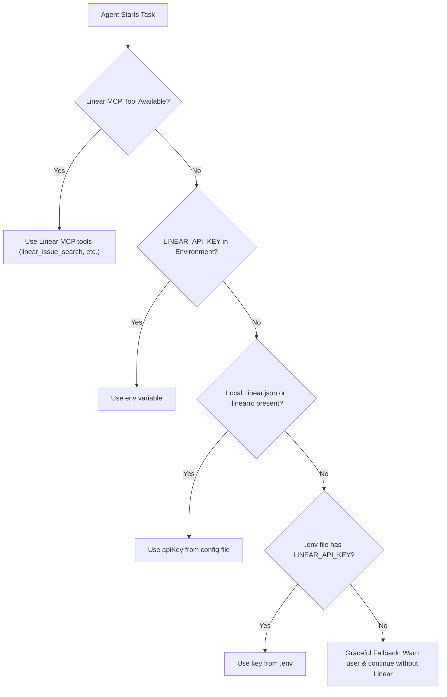

# Dynamic Configuration & Credential Management for Linear

This guide outlines how `linear-workflow` securely and dynamically resolves credentials, teams, and project settings across developer machines and repositories without hardcoding secrets.

---

## 1. Zero-Hardcode Guarantee

**Security Standard**: No API tokens, passwords, or personal keys may ever be committed into repository code or written directly into the skill prompt.

Access is resolved dynamically in the following priority order:



---

## 2. Dynamic Discovery Mechanisms

### Option A: Environment Variables (Recommended for CI & Local Dev)

Set the personal API key in your developer shell:

- **PowerShell (Windows)**:
  ```powershell
  $env:LINEAR_API_KEY="lin_api_xxxxxxxxxxxxxxxxxxxxxx"
  # Or permanently in user environment:
  [System.Environment]::SetEnvironmentVariable('LINEAR_API_KEY', 'lin_api_xxxxxxxxxxxxxxxxxxxxxx', 'User')
  ```

- **Bash / Zsh (Linux / macOS)**:
  ```bash
  export LINEAR_API_KEY="lin_api_xxxxxxxxxxxxxxxxxxxxxx"
  # Or in ~/.bashrc or ~/.zshrc
  ```

### Option B: Project Configuration File (`.linear.json`)

Developers can place a `.linear.json` file in the root of any repository to specify project mappings and default labels.

```json
{
  "team": "ENG",
  "project": "Rent Easy",
  "defaultLabels": ["Front"],
  "apiKey": "${LINEAR_API_KEY}"
}
```

> [!TIP]
> If a real token is provided directly inside `.linear.json`, make sure `.linear.json` is added to `.gitignore`. Alternatively, use the environment variable reference `${LINEAR_API_KEY}`.

### Option C: Official Linear MCP Server (`https://mcp.linear.app/mcp`)

Linear provides an official, plug-and-play Model Context Protocol server ([linear.app/docs/mcp](https://linear.app/docs/mcp)) that authenticates via OAuth 2.1 without needing manual API key management:

- **Endpoint**: `https://mcp.linear.app/mcp`

#### Claude Code (CLI):
```bash
claude mcp add --transport http linear https://mcp.linear.app/mcp
```
Run `/mcp` in your session to complete the one-time browser OAuth flow.

#### Cursor (`mcp.json`):
```json
{
  "mcpServers": {
    "linear": {
      "url": "https://mcp.linear.app/mcp"
    }
  }
}
```

#### Antigravity CLI / Stdio Bridge (`mcp-remote`):
```json
{
  "mcpServers": {
    "linear": {
      "command": "npx",
      "args": ["-y", "mcp-remote", "https://mcp.linear.app/mcp"]
    }
  }
}
```

#### Self-Hosted / Personal API Key Fallback:
If using community or offline MCP servers:
```json
{
  "mcpServers": {
    "linear": {
      "command": "npx",
      "args": ["-y", "@modelcontextprotocol/server-linear"],
      "env": {
        "LINEAR_API_KEY": "lin_api_xxxxxxxxxxxxxxxxxxxxxx"
      }
    }
  }
}
```

---

## 3. How to Obtain a Linear Personal API Key

1. Log in to your workspace at [Linear](https://linear.app).
2. Go to **Settings** ➔ **My Account** ➔ **Security & Access** ➔ **Personal API Keys**.
3. Click **Create Key**, give it a name (e.g. `AI Agent Workflow`), and assign read/write permissions.
4. Copy the generated key (`lin_api_...`) and export it as `LINEAR_API_KEY`.

---

## 4. Graceful Degradation (Fallback Protocol)

If neither Linear MCP tools nor a valid `LINEAR_API_KEY` are found:
1. The agent **MUST NOT** abort or crash.
2. The agent outputs an initial non-blocking notification:
   > `ℹ️ [Linear]: Nenhuma credencial do Linear encontrada (LINEAR_API_KEY não definida). O desenvolvimento continuará normalmente sem integração com o Linear.`
3. The agent proceeds with the user's requested development or planning task.
4. At the end of the response, the agent provides a brief reminder of how to configure `LINEAR_API_KEY`.
