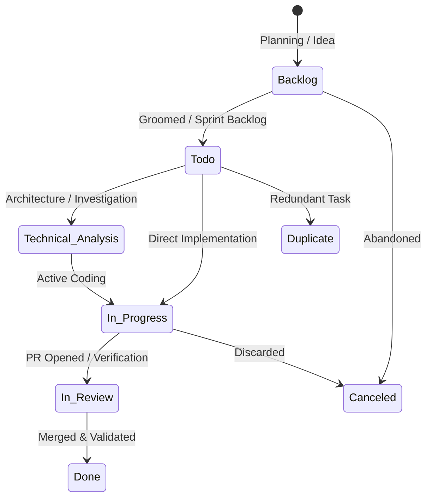

# Linear States, Lifecycle Transitions & Subproject Labeling

This reference details the official lifecycle state progression, rules for card movement, and automatic labeling strategies for monorepos and split projects (Frontend & Backend).

---

## 1. Linear Workflow State Machine

Every task tracked via `linear-workflow` follows this standard progression:



### State Definitions & Trigger Criteria

| State | Role & Description | When to Transition Here |
| :--- | :--- | :--- |
| **`Backlog`** | Unscheduled backlog items | When breaking down broad plans or brainstorming future features during planning sessions. |
| **`Todo`** | Actionable tasks ready for development | When a card has been refined with clear acceptance criteria and is ready to be picked up. |
| **`Technical Analysis`** | Architecture design, spikes, research | When the agent is tasked with designing architecture, performing deep codebase analysis, or exploring technical alternatives before coding. |
| **`In Progress`** | Active implementation | **As soon as coding begins** for a planned or newly created task. |
| **`In Review`** | Quality verification, Pull Request, testing | When implementation is completed, automated tests pass, and a Pull Request is opened or code is submitted for user review. |
| **`Done`** | Shipped and completed | When the Pull Request is merged or the user validates that the feature is fully delivered and operational. |
| **`Canceled`** | Deprecated or obsolete | When the user explicitly cancels or abandons a planned feature. |
| **`Duplicate`** | Redundant with existing issue | When the task overlaps completely with an existing Linear card. |

---

## 2. Subproject & Multi-Repository Matching

In many enterprise architectures, a single product in Linear spans multiple repositories or subprojects (e.g., Linear project **"Rent Easy"**, with codebases **"Rent Easy Frontend"** and **"Rent Easy Backend"**).

### Detection Rules

1. **Parent Project Resolution**:
   - If the local project name is `rent-easy-frontend`, `rent-easy-backend`, `renteasy_app`, etc., clean and normalize the name by stripping common suffixes (`frontend`, `backend`, `mobile`, `web`, `api`, `service`).
   - Match against Linear projects: a query for "Rent Easy Frontend" matches parent project **"Rent Easy"**.

2. **Automatic Label Application**:
   When creating or updating an issue in a matched parent project, inspect the local workspace tech stack and apply component labels:

   - **`Front`**:
     - Markers: Flutter (`pubspec.yaml`), React / Vue / Angular / Next.js / Svelte (`package.json` with frontend dependencies), iOS (`Podfile`), Android (`app/build.gradle`), HTML/CSS.
     - Folder/repo names containing: `frontend`, `web`, `mobile`, `ui`, `client`, `app`.
   
   - **`Back`**:
     - Markers: Spring Boot / Java (`pom.xml`, `build.gradle.kts`), Node.js backend (NestJS, Express, Fastify), Python (FastAPI, Django, Flask), Go (`go.mod`), Rust (`Cargo.toml`), SQL migrations.
     - Folder/repo names containing: `backend`, `api`, `service`, `server`, `core`.

3. **Fallback & Override**:
   - If `.linear.json` contains `"defaultLabels": ["Front"]` or `"defaultLabels": ["Back"]`, that explicit setting takes precedence.
   - If Linear does not already have a `Front` or `Back` label, create it under the team.

---

## 3. Transparency & User Notifications

Every Linear transition or query must be communicated explicitly in the AI agent's response to the user.

### Standard Notification Templates

- **Task Found & Started**:
  > `📋 [Linear]: Task identificada no projeto Rent Easy: LIN-104 - "Implementar tela de listagem de imóveis". Status atualizado para 'In Progress'. Labels: ['Front'].`

- **New Task Created & Started**:
  > `➕ [Linear]: Nova task criada no projeto Rent Easy: LIN-152 - "Adicionar filtro por faixa de preço". Status: 'In Progress'. Labels: ['Front'].`

- **Task Moved to Review**:
  > `🔍 [Linear]: Task LIN-104 movida para 'In Review'. PR #45 aberto no repositório com o resumo das alterações.`

- **Task Completed**:
  > `✅ [Linear]: Task LIN-104 atualizada para 'Done'. Entrega concluída e verificada com sucesso.`

- **Project Not Found in Linear**:
  > `⚠️ [Linear]: Projeto 'NovoProjetoX' não encontrado no Linear. O desenvolvimento seguiu normalmente sem vincular cards.`

---

## 4. Linear Agent Interaction Guidelines (AIG Compliance)

In accordance with official Linear guidelines ([linear.app/developers/agents](https://linear.app/developers/agents)):

1. **Clear Identity Signaling**:
   - Every comment posted by the agent to a Linear issue must be clearly identified with an agent header to prevent confusion in team activity feeds:
     ```markdown
     🤖 **AI Agent Update**:
     - Status: Implemented & verified via automated tests.
     - Commits: `abc1234`
     - Notes: Added biometric authentication flow with fallback to PIN.
     ```
2. **Native Git Automation Integration**:
   - When creating Git branches (alongside `git-workflow`), use the standard Linear branch format `<type>/<identifier>-<slug>` (e.g., `feat/RENT-104-biometric-auth`).
   - Linear natively detects this branch name to automate issue tracking across Pull Requests.
3. **Non-Destructive Context Enrichment**:
   - Never overwrite or wipe existing issue descriptions provided by human product managers or developers.
   - Append technical context or post new observations via comments.

