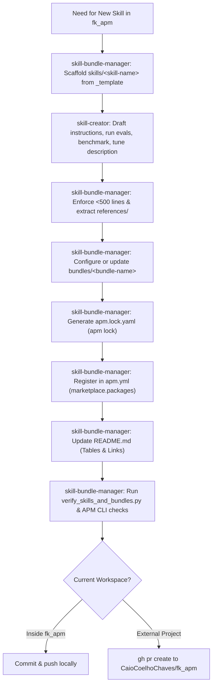

# Skill & Bundle Manager for `fk_apm`

A specialized workflow skill for adding, configuring, bundling, and registering AI skills in the central `fk_apm` repository.

> [!IMPORTANT]
> **This skill is NOT a skill prompt/content creator.**
> - Use [`skill-creator`](../skill-creator/SKILL.md) to author prompt logic, conduct evals, benchmark performance, and optimize triggering descriptions.
> - Use `skill-bundle-manager` to scaffold skills according to repository conventions, organize skills into bundles, generate lockfiles, register packages in `apm.yml`, update `README.md` documentation, and verify APM marketplace integrity.
> - **Use them together:** When creating a new skill for `fk_apm`, use `skill-bundle-manager` to set up the proper file structure, pair with `skill-creator` to craft and test the skill content, and finally use `skill-bundle-manager` to register, bundle, document, lock, and validate the additions.

---

## Core Non-Negotiable Standards

Every addition to `fk_apm` must adhere to these rules:

1. **Naming & Directory Matching**:
   - Skills must live in `skills/<skill-name>/`.
   - Bundles must live in `bundles/<bundle-name>/`.
   - Folder names and YAML `name:` fields must be lowercase kebab-case and match identically.
2. **Valid Frontmatter**:
   - Every `SKILL.md` must start with YAML frontmatter containing `name`, `description`, and `allowed-tools`.
   - Frontmatter `description` must include clear trigger conditions and remain under 1,024 characters.
3. **Progressive Disclosure**:
   - Keep `SKILL.md` body under **500 lines**.
   - Move deep dives, edge cases, and verbose code blocks into `references/*.md`.
   - Place automation or verification scripts in `scripts/`.
4. **Bundle Specification & Lockfiles**:
   - Every bundle must have `bundles/<bundle-name>/apm.yml` specifying dependencies via `../../skills/<skill-name>`.
   - Every bundle **must** have an up-to-date `apm.lock.yaml` generated via `apm lock`.
5. **Marketplace Catalog Registration**:
   - Every skill and bundle must be cataloged under `marketplace.packages` in the root `apm.yml`.
6. **Documentation Synchronization**:
   - **NEVER** conclude adding a skill or bundle without updating `README.md` tables (`### Available Bundles` and/or `### Individual Skills`) and repository structure.
7. **APM Verification**:
   - Always run `apm marketplace check --offline`, `apm pack`, and `apm audit` before finishing.

---

## Workflow 1: Adding a New Skill to `fk_apm`

Follow these steps when adding a skill to the repository:

### Step 1: Scaffold Directory from Template
If building a new skill from scratch, copy from `skills/_template`:
```bash
cp -r skills/_template skills/<skill-name>
```
If importing a skill created via `skill-creator`, move/copy it into `skills/<skill-name>`.

### Step 2: Ensure Frontmatter & Layout Conventions
Verify `skills/<skill-name>/SKILL.md`:
```yaml
---
name: <skill-name>
description: <Concise 1-3 sentence summary of what the skill does and when to invoke it>
allowed-tools: Read,Glob,Grep
---
```
- Verify that `name` matches `<skill-name>` exactly.
- Verify body length is < 500 lines. Split large guides into `references/`.

### Step 3: Bundle Assignment
Decide where the skill belongs:
- **Existing Bundle**: Add dependency `- ../../skills/<skill-name>` to `bundles/<target-bundle>/apm.yml`.
- **New Bundle**: Follow [Workflow 2: Creating a New Bundle](#workflow-2-creating-a-new-bundle).
- **Default Bundle**: If it is an essential agent or APM workflow tool, consider adding it to `bundles/default/apm.yml`.
- **Standalone**: If purely standalone, no bundle addition needed.

If added to any bundle, navigate to `bundles/<target-bundle>` and run `apm lock`.

### Step 4: Register in Root `apm.yml`
Add an entry under `marketplace.packages` in root `apm.yml`:
```yaml
    - name: <skill-name>
      description: <Clear, concise description>
      source: ./skills/<skill-name>
      version: 0.1.0
```

### Step 5: Update `README.md`
Add a new row to `### Individual Skills` table:
```markdown
| **`<skill-name>`** | <Description> | <Allowed Tools> | [`skills/<skill-name>/`](skills/<skill-name>/SKILL.md) |
```
If the skill was added to an existing bundle, also update that bundle's `Included Skills` list in the `### Available Bundles` table.

### Step 6: Verify Consistency
Run the repository verification suite:
```bash
python skills/skill-bundle-manager/scripts/verify_skills_and_bundles.py
apm marketplace check --offline
apm pack
apm audit
```

---

## Workflow 2: Creating a New Bundle

Follow these steps to create and publish a new bundle:

### Step 1: Create Directory and Manifest
Create `bundles/<bundle-name>/apm.yml`:
```yaml
name: <bundle-name>
version: 0.1.0
description: Clear, human-readable summary of the bundled skills and target domain
author: Caio Coelho Chaves
license: MIT

dependencies:
  apm:
    - ../../skills/first-skill-name
    - ../../skills/second-skill-name
  mcp: []
```

### Step 2: Generate the Lockfile
Generate `bundles/<bundle-name>/apm.lock.yaml` using the APM CLI:
```bash
cd bundles/<bundle-name>
apm lock
cd ../..
```
*(In PowerShell):*
```powershell
Push-Location bundles/<bundle-name>
apm lock
Pop-Location
```

### Step 3: Register in Root `apm.yml`
Add the bundle under `marketplace.packages` in root `apm.yml`:
```yaml
    - name: <bundle-name>
      description: <Bundle description>
      source: ./bundles/<bundle-name>
      version: 0.1.0
```

### Step 4: Update `README.md`
1. Add a new row to `### Available Bundles` table:
```markdown
| **`<bundle-name>`** | <Description> | `<skill-1>`, `<skill-2>` | [`bundles/<bundle-name>/`](bundles/<bundle-name>/apm.yml) |
```
2. If appropriate, add consumer installation examples under `### Step 2: Add the Bundle to Your Project`:
```bash
apm install CaioCoelhoChaves/fk_apm/bundles/<bundle-name>
```

### Step 5: Verify Consistency
```bash
python skills/skill-bundle-manager/scripts/verify_skills_and_bundles.py
apm marketplace check --offline
apm pack
apm audit
```

---

## Workflow 3: Contributing from Another Project (Automated PR Workflow)

Follow this workflow when running from an external repository (e.g. `fk_booster`, client apps, games) and proposing a new skill or bundle for `fk_apm`:

### Step 1: Detect Environment Context
Check if the current workspace root is `fk_apm`:
```bash
cat apm.yml 2>/dev/null | grep "name: fk_apm"
```
If not found, you are in **External Project Mode**.

### Step 2: Locate or Clone `fk_apm`
1. Check for a local sibling clone first (e.g. `../fk_apm`, `../../fk_apm`, or `../../fk_packages/fk_apm`).
2. If not found locally, clone `fk_apm` using GitHub CLI into a sibling or workspace directory:
```bash
gh repo clone CaioCoelhoChaves/fk_apm ../fk_apm
```
Set `<FK_APM_ROOT>` to this path.

### Step 3: Branch Preparation in `fk_apm`
```bash
cd <FK_APM_ROOT>
git checkout main
git pull origin main
git checkout -b feat/add-<skill-name>
```

### Step 4: Transfer & Standardize
1. Copy the skill from your consumer project into `<FK_APM_ROOT>/skills/<skill-name>/`.
2. Ensure `name` in frontmatter matches `<skill-name>`, lines < 500, and allowed tools are declared.
3. Wire into bundles under `<FK_APM_ROOT>/bundles/` if applicable, and run `apm lock` in that bundle folder.
4. Register the new skill/bundle in `<FK_APM_ROOT>/apm.yml` under `marketplace.packages`.
5. Update `<FK_APM_ROOT>/README.md` tables (`Available Bundles` / `Individual Skills`).

### Step 5: Verification & Integrity Check
Inside `<FK_APM_ROOT>`:
```bash
python skills/skill-bundle-manager/scripts/verify_skills_and_bundles.py
apm marketplace check --offline
apm pack
apm audit
```

### Step 6: Commit, Push & Create PR
```bash
git add .
git commit -m "feat(skills): add <skill-name> to fk_apm catalog"
git push -u origin feat/add-<skill-name>

gh pr create \
  --repo CaioCoelhoChaves/fk_apm \
  --title "feat(skills): add <skill-name>" \
  --body "## Summary
Adds the \`<skill-name>\` skill to the central fk_apm repository.

### Changes
- Scaffolding & Frontmatter configured in \`skills/<skill-name>/\`
- Registered in root \`apm.yml\` under \`marketplace.packages\`
- Updated \`README.md\` catalog tables
- Executed \`verify_skills_and_bundles.py\` & \`apm audit\`"
```
Provide the resulting PR URL to the user.

---

## Pairing with `skill-creator`

When designing new skills for `fk_apm`:



---

## Common Pitfalls & How to Avoid Them

| Pitfall | Consequence | Prevention |
| :--- | :--- | :--- |
| **Forgetting `README.md`** | Users and agents cannot discover the new skill or bundle in docs | Always add rows to both `Available Bundles` and `Individual Skills` tables |
| **Missing `apm.lock.yaml` in bundle** | Bundle installation fails or causes drift in consumer projects | Always run `apm lock` inside the bundle folder |
| **Relative path mismatch in bundle** | APM cannot locate bundled skills | Always use `../../skills/<skill-name>` |
| **Forgetting root `apm.yml`** | Package not exposed in marketplace or catalog | Add to `marketplace.packages` in root `apm.yml` |
| **Not running `apm pack`** | `.claude-plugin/marketplace.json` is out of sync | Run `apm pack` after modifying `marketplace.packages` |
| **Monolithic `SKILL.md` (>500 lines)** | Degrades AI context performance | Extract long examples and guides to `references/*.md` |
| **Direct push to main from external project** | Bypass review or pollute working tree | Always create branch and use `gh pr create` |

---

## References & Utilities

- [references/bundle-guide.md](references/bundle-guide.md) — Comprehensive guide on bundle manifests, dependency syntax, and lockfile lifecycle.
- [references/readme-sync-guide.md](references/readme-sync-guide.md) — Exact table formats, column conventions, and markdown guidelines for `README.md`.
- [references/cross-project-pr-guide.md](references/cross-project-pr-guide.md) — Step-by-step cross-project contribution and GitHub PR workflow using `gh` CLI.
- `scripts/verify_skills_and_bundles.py` — Automated verification script validating integrity across all skills, bundles, `apm.yml`, and `README.md`.

